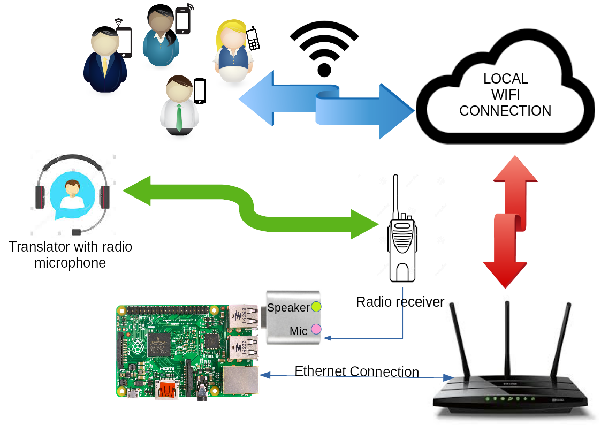

Purpose
===

The scope of this project is to build a system to easily spread a translation, made by a human, over the air. There are plenty of professional system out in the world. But they can be fairly expensive. So the initial requirement came to some months ago when in the Church where I was asked to evaluate how to do it. After a short research I found out some very nice how to regarding the software part. Essentially two main software are used: icecast to create an shareable stream and darkice to encode the audio input and pass to icecast. The Hardware part is a Raspberry PI 2 with a Wifi Access Point. The users will listen the translation, connecting their smartphone to the local wifi provided, using a media stream software like VLC or chrome that gives out of the box such functionality. 

