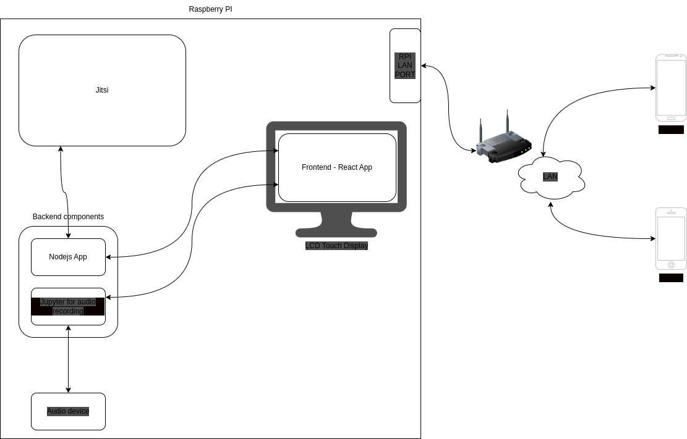

- [Intro](#intro)
  - [Consideration](#consideration)
  - [Goals](#goals)
  - [Architecture](#architecture)
- [Requirements](#requirements)
- [Setup](#setup)
  - [How to prepare the SD card with Ubuntu 22.04](#how-to-prepare-the-sd-card-with-ubuntu-2204)
  - [Boot Ubuntu](#boot-ubuntu)
  - [Important notes](#important-notes)
  - [Installation](#installation)
    - [Audio Setup - To be confirmed](#audio-setup---to-be-confirmed)
  - [Chromium installation - To be confirmed](#chromium-installation---to-be-confirmed)
  - [Jitsi setup](#jitsi-setup)
    - [Jitsi customization](#jitsi-customization)
    - [Recompile jniwrapper-native-1.0-SNAPSHOT](#recompile-jniwrapper-native-10-snapshot)
  - [SSL Certificate](#ssl-certificate)
    - [SSL Certificate creation](#ssl-certificate-creation)
    - [Nginx SSL Certificate configuration](#nginx-ssl-certificate-configuration)
    - [Jitsi SSL Certificate configuration](#jitsi-ssl-certificate-configuration)
  - [Enable the NGINX config](#enable-the-nginx-config)
  - [Prosody setup](#prosody-setup)
  - [Audio Recording](#audio-recording)
    - [Asound conf - Is this used in the last pulse version?](#asound-conf---is-this-used-in-the-last-pulse-version)
    - [Create the output sink called recording](#create-the-output-sink-called-recording)
    - [Attach the Mic to the sink](#attach-the-mic-to-the-sink)
    - [Test the recording with PulseAudio](#test-the-recording-with-pulseaudio)
    - [Audio Recording References](#audio-recording-references)
    - [Jupyter setup to record the audio with Python](#jupyter-setup-to-record-the-audio-with-python)
  - [Network setup](#network-setup)
  - [Backend setup](#backend-setup)
    - [Node Js](#node-js)
  - [Frontend setup](#frontend-setup)
  - [GUI](#gui)
    - [GUI Tuning](#gui-tuning)
    - [VNC Setup](#vnc-setup)
      - [VNC config](#vnc-config)
- [Challenge](#challenge)
- [Best practices](#best-practices)
- [Todo](#todo)

# Intro

This is the next version of the Translation System. With the legacy system based on Icecast and Darkice we got good the results in terms of easiness of implementation and usabiity but the latency (1-3 secs) is not anymore acceptable.

We are now aiming to have short latency between the original voice and the translation.

The goal is to have a translator hearing the original audio and all the other listening it without any video/comments/or other interruptions allowed.

The software choosen is Jitsi were we have very short delays.

## Consideration

Running Jitsi on a Raspberry PI can looks trivial, and installing the software it is but the goal is to make the translator independent by any other device and have the meeting in control.
The translator is not a technical person and therefore the interaction with the Raspberry PI must be as easy as possible like as well the user part.

Jitsi has per se some hard requirements to work properly

## Goals

- close to zero delay
- the system can works also in a not internet connected network
- the traffic is every case not leaving the LAN
- the translator is autonomous in starting the meeting
- he can control the meeting
  - rejoin
  - restart
  - mute all
  - check the partipants counts
  - poweroff
- *the translated audio can be recorded - optional*

## Architecture


The choosen OS is Ubuntu for Raspberry PI 4. The reason is that the Raspberry PI OS is not supporting the latest version of Jitsi and the Ubuntu is the only one that is supporting it.

# Requirements
- Raspberry PI 4 (2GB) or higher - With the 4GB version you would need less tuning for Jitsi
- An USB microphone adapter - Write the model here
- Microphone
- A valid SSL certificate
# Setup

## How to prepare the SD card with Ubuntu 22.04
Download the Ubuntu 22.04 Server image from [Ubuntu](https://ubuntu.com/download/raspberry-pi/thank-you?version=22.04.2&architecture=server-arm64+raspi).
Identify the disk with the SD card using lsblk or df to see the mounted device. Be sure to umount before flash it.

Flash it on the SD card with the following commands:
    SD_DEVICE="PUT YOUR VALUE HERE" # I.E: /dev/sde

    xz -d ubuntu-22.04.2-preinstalled-server-arm64+raspi.img.xz
    sudo dd bs=4M if=./ubuntu-22.04.2-preinstalled-server-arm64+raspi.img of=$SD_DEVICE conv=fdatasync status=progress

Or use the Raspberry PI Imager[*]

    sudo apt install rpi-imager
    rpi-imager

[*]: https://discourse.ubuntu.com/t/how-to-install-ubuntu-server-on-your-raspberry-pi/14660

## Boot Ubuntu
We still need some manual operation to configure the system. The first step is to boot the Raspberry PI and configure the network attaching the RP to a monitor and a keyboard.
- Login with ubuntu/ubuntu
- Configure the network with netplan
- Enable and start the ssh service

**Can we automate this step?**
## Important notes
> ⚠️ **PORT 8888 for jicofo**
> 
> If the port is busy everything seems to starts but the participants cannot see each others! [issue-6449][1]

[1]: https://github.com/jitsi/jitsi-meet/issues/6449 "Issue 6449"

## Installation
    sudo apt install openjdk-8-jdk-headless openjdk-8-jre openjdk-8-jre-headless openjdk-8-jdk
    sudo apt-get install default-jre-headless ffmpeg curl alsa-utils icewm xdotool xserver-xorg-video-dummy ruby-hocon

  	sudo usermod -aG adm,audio,video,plugdev jibri

    update-alternatives --config java # Select openjdk-8

### Audio Setup - To be confirmed
To work properly Jitsi need the aloop module. It can be found in the package `linux-modules-extra-5.15.0-1015-raspi`

    apt install linux-modules-extra-5.15.0-1015-raspi
    rm /lib/systemd/system/alsa-utils.service ; systemctl daemon-reload
    apt install unzip ffmpeg curl alsa-utils icewm xdotool  xserver-xorg-video-dummy # Why this?

## Chromium installation - To be confirmed

Chrome is not compiled anymore for RaspPI therefore we are using Chromium. See [3], [4]
[3]: https://askubuntu.com/questions/1204571/how-to-install-chromium-without-snap
[4]: https://packages.debian.org/bullseye/arm64/apt/download

The default Chromium version is a snap package and it doesn't suit my needs because I need to customize some aspects of the browser.

Edit the file /etc/apt/sources.list.d/debian.list and add the following lines:

		deb [arch=arm64] http://ftp.ch.debian.org/debian bullseye main 
		deb [arch=arm64] http://ftp.ch.debian.org/debian bullseye-updates main 

Remove the snap version of Chromium

    sudo apt remove chromium-browser chromium-browser-l10n chromium-codecs-ffmpeg-extra
    sudo apt-key adv --keyserver keyserver.ubuntu.com --recv-keys CC9673A4F27B8DD47936 62A9605C66F00D6C9793 # 11/bullseye
    sudo apt-key adv --keyserver keyserver.ubuntu.com --recv-keys BCDDDC30D7C23CBBABEE # 10/buster Maybe

Update the package list
    vi /etc/apt/preferences.d/chromium.pref
      # Note: 2 blank lines are required between entries
      Package: *
      Pin: release a=eoan
      Pin-Priority: 500

    
      Package: *
      Pin: origin "deb.debian.org"
      Pin-Priority: 300


      # Pattern includes 'chromium', 'chromium-browser' and similarly
      # named dependencies:
      Package: chromium*
      Pin: origin "deb.debian.org"
      Pin-Priority: 700	

Install the normal Chromium package
    apt update && apt install chromium/stable chromium-driver/stable

To avoid the warning message about the security of the browser we need to disable the security warning.    
    mkdir -p /etc/opt/chrome/policies/managed
    echo '{ "CommandLineFlagSecurityWarningsEnabled": false }' >>/etc/opt/chrome/policies/managed/managed_policies.json

    https://www.linuxcapable.com/how-to-install-chromium-browser-on-ubuntu-22-04-lts/
    I need a plain installation to customize it. True?
    See APT Method with PPA
    sudo add-apt-repository ppa:savoury1/chromium -y
    sudo add-apt-repository ppa:savoury1/ffmpeg4 -y
    apt update
    apt install google-chrome-stable
## Jitsi setup
Limit the memory usage
Edit the file /etc/jitsi/videobridge/config and add the following line:
    
    VIDEOBRIDGE_MAX_MEMORY=1024m

And restart the videobridge.

Edit the file  /etc/jitsi/jicofo/config , add the following line:

    JICOFO_MAX_MEMORY=1024m

And restart Jicofo.

### Jitsi customization
Edit the file /etc/jitsi/meet/translation.home.local-config.js
### Recompile jniwrapper-native-1.0-SNAPSHOT
To work properly under ARM64 the jniwrapper-native-1.0-SNAPSHOT.jar must be recompiled. See [gist][2] for more details.

    git clone https://github.com/sctplab/usrsctp.git
    git clone https://github.com/jitsi/jitsi-sctp
    mv ./usrsctp ./jitsi-sctp/usrsctp/
    cd ./jitsi-sctp
    mvn package -DbuildSctp -DbuildNativeWrapper -DdeployNewJnilib -DskipTests

Copy libjnisctp.so

    cp ./jniwrapper/native/target/libjnisctp-linux-aarch64.so \
    ./jniwrapper/native/src/main/resources/lib/linux/libjnisctp.so

Re-package and Copy jniwrapper-native-1.0-SNAPSHOT.jar into Jitsi VideoBridge2

When running mvn package ensure all unit tests are successful. You will see some warnings about "Using platform encoding", but that's fine because we're building on the platform that we intend to run this on anyway.

    mvn package
    sudo cp ./jniwrapper/native/target/jniwrapper-native-1.0-SNAPSHOT.jar \
    /usr/share/jitsi-videobridge/lib/jniwrapper-native-1.0-SNAPSHOT.jar

[2]: https://gist.github.com/krithin/e50a6001c8435e46cb85f5c6c78e2d66

## SSL Certificate
### SSL Certificate creation
See the document [letsencrypt.md](./letsencrypt.md)
### Nginx SSL Certificate configuration
New file /etc/nginx/sites-available/translation.sennsolution.com.conf with the new domain

### Jitsi SSL Certificate configuration
Cert copied in Jitsi folder following the one configured in the nginx config file
```bash
scp ~/letsencrypt/archive/translation.sennsolutions.com/fullchain1.pem pi@translation.home.local:/tmp/ 	# from bigone
mv /tmp/fullchain1.pem /etc/ssl/translation.sennsolutions.com.crt                         				# on translation

scp ~/letsencrypt/archive/translation.sennsolutions.com/privkey1.pem pi@translation.home.local:/tmp/	# from bigone
mv /tmp/privkey1.pem /etc/ssl/translation.sennsolutions.com.key					                        # on translation

# Create a new Jitsi config with all the domain changed
vi /etc/jitsi/meet/translation.senncolutions.com-config.js

#Update all Jitsi config
cd /etc/jitsi
sed -i=bck 's/home\.local/sennsolutions\.com/' jibri/jibri.conf jicofo/config jicofo/jicofo.conf videobridge/sip-communicator.properties videobridge/config videobridge/jvb.conf


#Update Prosodi
cd /etc/prosody
sed': sed -i.bck 's/translation\.home\.local/translation\.sennsolutions\.com/g' prosody.cfg.lua
cd conf.avail
create a file /etc/prosody/conf.avail/translation.sensolutions.com.cfg.lua with all the domain changed
sed': sed -i.bck 's/translation\.home\.local/translation\.sennsolutions\.com/g' translation.sensolutions.com.cfg.lua
cd ../conf.d
ln -s /etc/prosody/conf.avail/translation.sensolutions.com.cfg.lua

## create the prosody cert
# This certificate is for Prosody. 
# It expires on Jan 14 2024 - Can We make it longer?
# Whats happens if it expires?
cd /etc/prosody/certs
make translation.sennsolutions.com.cnf
make translation.sennsolutions.com.key
make translation.sennsolutions.com.cnf.csr
make translation.sennsolutions.com.cnf.crt
mv translation.sennsolutions.com.cnf.crt translation.sennsolutions.com.crt
mv translation.sennsolutions.com.cnf.key translation.sennsolutions.com.key
mv translation.sennsolutions.com.cnf.csr translation.sennsolutions.com.csr

# Restart the Jitsi services to apply the new config
```

## Enable the NGINX config
```bash
cd /etc/nginx/sites-enabled
ln -s /etc/nginx/sites-available/translation.sennsolution.com.conf
rm translation.home.local.conf
systenctl restart nginx
```
## Prosody setup

    prosodyctl register jibri auth.translation.home.local jibriauthpass
    prosodyctl register recorder recorder.translation.home.local jibrirecorderpass

    ln -s /etc/opt/chrome/policies/ /etc/chromium/ # config for chrome and Chromium are stored in different placeS

## Audio Recording
To record the audio Jibri should be used but I couldn't manage to make it working.
So I am recording the audio with Python intercepting the Audio device.


### Asound conf - Is this used in the last pulse version?
Edit the file /etc/asound.conf 
    pcm.trans {
        type dsnoop
        ipc_key 5678293
        ipc_perm 0666
        ipc_gid audio
      slave {
            pcm "hw:2,0" 
            channels 2 
            #period_size 1024
            #buffer_size 4096
            #rate 48000
            #periods 0 
            #period_time 0
        }
    }

### Create the output sink called recording

    pacmd load-module module-null-sink sink_name=recording sink_properties=device.description=recording

    pacmd list-sinks | egrep '^\s+name: .*'
            name: <alsa_output.usb-Creative_Technology_Ltd_Sound_Blaster_Play__3_00252407-00.analog-stereo>
            name: <alsa_output.platform-bcm2835_audio.stereo-fallback>
            name: <alsa_output.platform-bcm2835_audio.stereo-fallback.2>

The first one is the USB Mic

    pacmd load-module module-combine-sink sink_name=combined sink_properties=device.description=combined slaves=recording,alsa_output.usb-Creative_Technology_Ltd_Sound_Blaster_Play__3_00252407-00.analog-stereo

### Attach the Mic to the sink
    pacmd list-sources | egrep '^\s+name: .*' | grep input
            name: <alsa_input.usb-Creative_Technology_Ltd_Sound_Blaster_Play__3_00252407-00.analog-stereo>

    pacmd load-module module-loopback source=alsa_input.usb-Creative_Technology_Ltd_Sound_Blaster_Play__3_00252407-00.analog-stereo sink=recording latency_msec=1

### Test the recording with PulseAudio
  parecord --channels=2 -d recording.monitor output.wav

### Audio Recording References

- http://mocha.freeshell.org/audio.html
- https://raw.githubusercontent.com/larsimmisch/pyalsaaudio/main/recordtest.py
- https://unix.stackexchange.com/questions/361594/device-or-resource-busy-error-thrown-when-trying-to-record-audio-using-arecord
- https://bbs.archlinux.org/viewtopic.php?id=187258
- https://alsa.opensrc.org/DmixPlugin
- https://alsa.opensrc.org/Dsnoop
- http://larsimmisch.github.io/pyalsaaudio/libalsaaudio.html#examples


### Jupyter setup to record the audio with Python
To start the python recording script I've used Jupyter Notebook with a different port:

    jupyter notebook --ip 0.0.0.0 --port 8889 

A problem that I found, is the difficulty to record the audio while the resource is used by another software. See [gist][5] for more details.

[5]: https://gist.github.com/varqox/c1a5d93d4d685ded539598676f550be8

TOFIX: Add the script to start the recording and or attach the Juypter notebook

## Network setup
## Backend setup

### Node Js
## Frontend setup

## GUI
The small LCD display doesn't allow to have a full GUI. The idea is to have a small display with some buttons to control the meeting.
To be able to control the meeting we need to have a way to interact with the Jitsi server. The idea is to use the Jitsi API to control the meeting. However a GUI is needed and we need to start XWindows to have it with a browser.

Chrome is not anymore available and therefore we are using Chromium with a React App. Chromium is started in a VNC session so that the system can be easily debugged/controlled remotely.

To start Jitsi as moderator you need to be the first to join the meeting. The first user is the moderator and can control the meeting. The moderator can mute all the users and can also unmute a single user.

The preferred way to start Jitsi is with
  
    https://translation.home.local/english#config.startWithAudioMuted=false&config.startWithVideoMuted=true

### GUI Tuning
To enhance the audio recording level I've started pavucontrol and set the Recording device level to 130%.

### VNC Setup
Vncserver is started via systemd with the follow config:
```bash
/etc/systemd/system/vncserver.service
[Unit]
Description=TightVNC server
After=syslog.target network.target

[Service]
Type=forking
User=pi
#PAMName=login
PIDFile=/home/pi/.vnc/%H:1.pid
ExecStartPre=-/usr/bin/vncserver -kill :1 > /dev/null 2>&1
ExecStart=/usr/bin/vncserver
ExecStop=/usr/bin/vncserver -kill :1 ; pkill parecord ; pkill pulseaudio

[Install]
WantedBy=multi-user.target
```

#### VNC config
TOFIX: Is the file /home/pi/.xsessionrc relevant?

```bash
.xsessionrc
# Works with vncserver
set -x
exec pulseaudio -v --start -D &
exec icewm --replace &
exec pacmd load-module module-null-sink sink_name=recording sink_properties=device.description=recording && \
pacmd load-module module-combine-sink sink_name=combined sink_properties=device.description=combined slaves=recording,alsa_output.usb-Creative_Technology_Ltd_Sound_Blaster_Play__3_00252407-00.analog-stereo && \
pacmd load-module module-loopback source=alsa_input.usb-Creative_Technology_Ltd_Sound_Blaster_Play__3_00252407-00.analog-stereo sink=recording &
exec chromium https://translation.home.local/english &
exec parecord --channels=2 -d recording.monitor /home/pi/output.wav &
```
# Challenge

# Best practices
- Best recording with the Mic at 5-10cm far from the mouth

# Todo

- Automated Raspberry Pi installation and configuration
- Display how many users are connected
- Show something when the botton Mute All is pressed
- Show when the translator voice is really transmitted
- SSL certificate automated update procedure
- Use the Raspberry Pi as a Wifi Access Point
- RO FS to avoid SD card corruption
